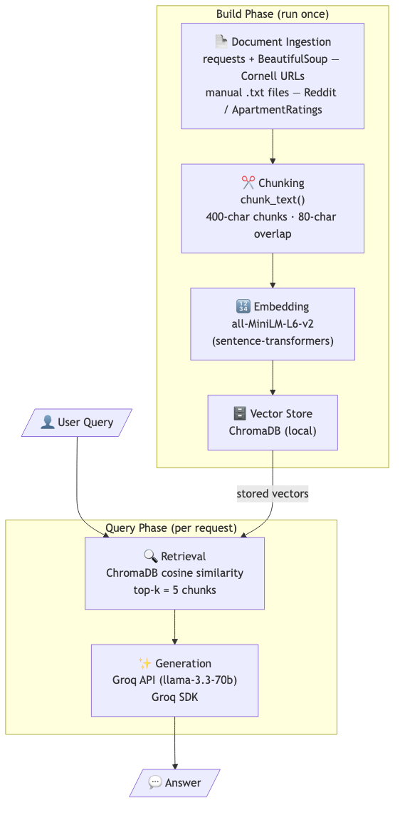

# Project 1 Planning: The Unofficial Guide

> Write this document before you write any pipeline code.
> Your spec and architecture diagram are what you'll use to direct AI tools (Claude, Copilot, etc.) to generate your implementation — the more specific they are, the more useful the generated code will be.
> Update the Retrieval Approach and Chunking Strategy sections if you change your approach during implementation.
> Update this file before starting any stretch features.

---

## Domain

<!-- What domain did you choose? Why is this knowledge valuable and hard to find through official channels? --> My domain is off-campus housing experiences for Cornell students, focusing on real apartment reviews, tenant complaints, neighborhood comparisons, and landlord feedback. Official university resources provide general guidance on the housing search process but rarely capture practical realities like maintenance responsiveness, noise levels, safety concerns, or whether a landlord will withhold your security deposit. This allows students to ask questions and get experience-based answers regarding an apartment of their choice.

---

## Documents

<!-- List your specific sources: URLs, subreddit names, forum threads, or file descriptions.
     Aim for at least 10 sources that together cover different subtopics or perspectives within your domain. -->

<!-- Ingestion status: ✅ = fetched by ingest.py | ⚠️ = 404/dead | 📋 = manually saved to documents/clean/ -->

1.  ✅ Cornell Ithaca Neighborhoods Guide — https://scl.cornell.edu/residential-life/housing/campus-living/housing-search-process/ithaca-neighborhoods
2.  ⚠️ Cornell Housing Search Process — https://scl.cornell.edu/residential-life/housing/campus-living/housing-search-process (404 — page removed; covered by sub-pages below)
3.  ✅ Cornell Signing the Lease Guide — https://scl.cornell.edu/residential-life/housing/campus-living/housing-search-process/signing-lease
4.  ✅ Cornell Rental Listings & Resources — https://scl.cornell.edu/residential-life/housing/campus-living/housing-search-process/rental-listings-resources
5.  ✅ Cornell Grad Tips: Renting & Tenant Rights — https://www.gradschool.cornell.edu/announcements/grad-tips-renting/
6.  ✅ Cornell Safe Living Environments — https://scl.cornell.edu/residential-life/housing/campus-living/housing-search-process/safe-living-environments
7.  ✅ Cornell Off-Campus Living News Article — https://scl.cornell.edu/news-events/news/supporting-journey-campus-living-cornells-comprehensive-housing-resources
8.  ✅ Cornell Off-Campus Living overview — https://scl.cornell.edu/residential-life/housing/campus-living
9.  📋 r/Cornell — Housing Situation at Cornell (Auden Ithaca) → documents/clean/auden.txt
10. 📋 r/ithaca — Moving to Titus Towers → documents/clean/titus_towers.txt
11. 📋 r/Cornell — Housing: northeast Ithaca vs downtown? → documents/clean/north_vs_downtown.txt
12. 📋 r/Cornell — Where to live in Ithaca? → documents/clean/where_to_live.txt

**Current ingestion stats:** 11 documents (8 auto-fetched, 4 manual), 109 chunks

---

## Chunking Strategy

<!-- How will you split documents into chunks?
     State your chunk size (in tokens or characters), overlap size, and explain why those
     numbers fit the structure of your documents.
     A review-heavy corpus warrants different chunking than a long FAQ. -->

**Chunk size:** 400 characters

**Overlap:** 80 characters

**Reasoning:** My corpus is mixed: short opinion-based reviews (ApartmentRatings, Reddit) and longer structured guides (Cornell pages). I will use a chunk size of 
400 characters with 80 characters of overlap. 400 characters is large enough to capture a complete review opinion or a full factual sentence with surrounding context, but focused enough that retrieval can match specific queries (e.g. "noise levels in Collegetown") without pulling in unrelated topics. The 80-character overlap prevents key facts near chunk boundaries from being split unrecoverably.

---

## Retrieval Approach

<!-- Which embedding model are you using (e.g., all-MiniLM-L6-v2 via sentence-transformers)?
     How many chunks will you retrieve per query (top-k)?
     If you were deploying this for real users and cost wasn't a constraint, what tradeoffs
     would you weigh in choosing a different embedding model — context length, multilingual
     support, accuracy on domain-specific text, latency? -->

**Embedding model:** all-MiniLM-L6-v2 (sentence-transformers), running locally.
Vector store: ChromaDB (local).

**Top-k:** 5 chunks per query.

**Production tradeoff reflection:**
- Cost: all-MiniLM-L6-v2 is free and local
- Context length: all-MiniLM-L6-v2 caps at 256 tokens, which fits my 400-character chunks but would truncate longer documents
- Accuracy: larger API-based models handle nuanced review language better
- Latency: local models avoid network calls but are slower on CPU; API models are faster but require internet connectivity
---

## Evaluation Plan

<!-- List your 5 test questions with their expected correct answers.
     Questions should be specific enough that you can judge whether the system's response
     is right or wrong. "What are good dining halls?" is too vague.
     "What do students say about wait times at [dining hall name] during lunch?" is testable. -->
1. Question: What are the characteristics of the Collegetown neighborhood 
   for Cornell students?
   Expected answer: Collegetown is close to campus (0.1–0.5 mile walk), popular with undergraduates, has high rent, noise, and congestion, features shopping and restaurants, and requires an uphill walk to campus from lower Collegetown.

2. Question: What should Cornell students ask a landlord before signing a lease?
   Expected answer: Students should ask about repair responsibilities, preferred contact method for emergencies, how long previous tenants stayed, why they left and how the security deposit was returned.

3. Question: What do student reviewers say about the management at 
   Cayuga Apartments?
   Expected answer: At least one reviewer describes Cayuga Apartments as "a wonderful community," while at least one other reviewer explicitly describes the management company as rude and unresponsive and states they were charged additional rent after moving out.

4. Question: What neighborhoods are recommended for Cornell graduate 
   students looking for lower rent?
   Expected answer: Downtown Ithaca and Fall Creek are noted for lower rents and a city neighborhood feel, with frequent bus service making the uphill commute to campus manageable.

5. Question: What resources does Cornell offer students who have problems 
   with their landlord?
   Expected answer: Cornell Off-Campus Living helps with all landlord issues regardless of size, connects students to the right resources, and covers problems ranging from mold and insects to lease disputes and security deposit conflicts.

---

## Anticipated Challenges

<!-- What could go wrong? Name at least two specific risks with reasoning.
     Consider: noisy or inconsistent documents, missing source attribution, off-topic
     retrieval, chunks that split key information across boundaries. -->

1. Bot-blocked sources producing empty documents: ApartmentRatings blocks 
   automated requests, meaning if the ingestion script tries to fetch those 
   URLs directly it will get an error or empty HTML instead of review text. 
   This will be mitigated by manually copying review text into .txt files 
   before running the pipeline.
2. Thin review coverage for specific apartments: The ApartmentRatings 
   corpus for Ithaca is small — some buildings have only 3–5 reviews. 
   Queries about specific apartments (e.g. "what do students say about 
   Cayuga Apartments maintenance?") may return too few chunks to generate 
   a grounded answer, forcing the system to either hallucinate or correctly 
   decline to answer.

---

## Architecture
<!-- Draw a diagram of your pipeline showing the five stages:
     Document Ingestion → Chunking → Embedding + Vector Store → Retrieval → Generation
     Label each stage with the tool or library you're using.
     You can use ASCII art, a Mermaid diagram, or embed a sketch as an image.
     You'll use this diagram as context when prompting AI tools to implement each stage. -->

---

## AI Tool Plan

<!-- For each part of the pipeline below, describe:
     - Which AI tool you plan to use (Claude, Copilot, ChatGPT, etc.)
     - What you'll give it as input (which sections of this planning.md, which requirements)
     - What you expect it to produce
     - How you'll verify the output matches your spec

     "I'll use AI to help me code" is not a plan.
     "I'll give Claude my Chunking Strategy section and ask it to implement chunk_text()
     with my specified chunk size and overlap" is a plan. -->
1. Document ingestion and cleaning script
   Tool: Claude
   Input: My Documents section (list of 10 sources with URLs and collection 
   methods), Milestone 3 requirements from the assignment, and a note that 
   ApartmentRatings and Reddit sources are pre-saved .txt files while Cornell 
   sources should be fetched via requests + BeautifulSoup.
   Expected output: A Python script that loads .txt files from a local 
   directory and fetches the 6 Cornell URLs, strips HTML navigation/boilerplate, 
   and outputs clean text strings ready for chunking.

2. Chunking script
   Tool: Claude
   Input: My Chunking Strategy section (400-character chunks, 80-character 
   overlap) and a sample cleaned document to test against.
   Expected output: A chunk_text() function that splits a string into 
   overlapping chunks of the specified size and returns them as a list, 
   plus a script that applies it to all documents and prints 5 sample chunks 
   for inspection.

3. Embedding and vector store setup
   Tool: Groq
   Input: My Retrieval Approach section (all-MiniLM-L6-v2, ChromaDB, k=5) 
   and my pipeline diagram.
   Expected output: A script that embeds all chunks using sentence-transformers, 
   stores them in ChromaDB with source metadata (filename, chunk index), and 
   exposes a retrieve(query, k=5) function returning chunks and source names.

**Milestone 3 — Ingestion and chunking:**

**Milestone 4 — Embedding and retrieval:**

**Milestone 5 — Generation and interface:**
